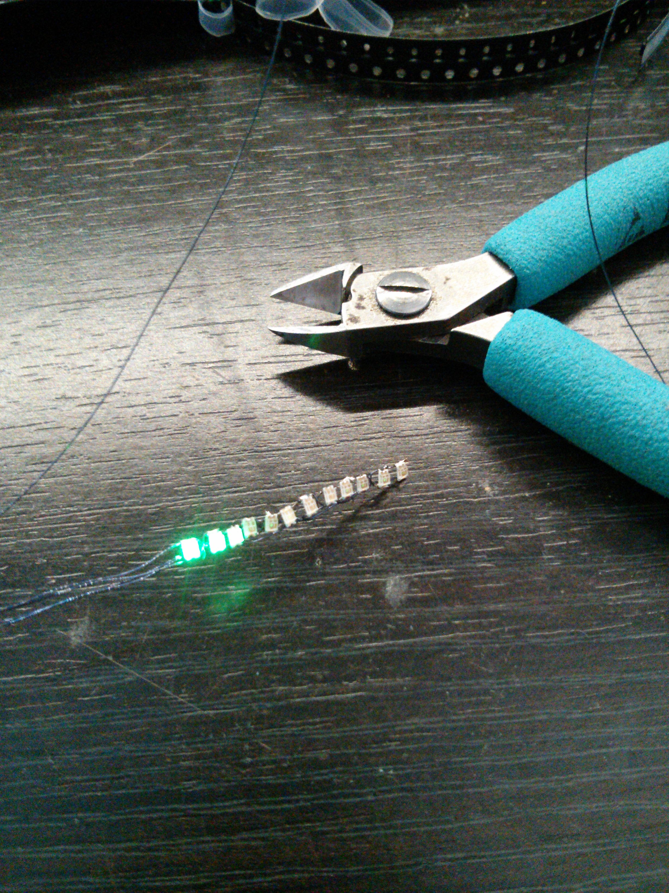

Firefly Jar
===========

LED effects to create a jar of fireflies. Based on [this jar of fireflies by Keso](http://www.instructables.com/id/Jar-of-Fireflies/), but this one uses strings of tiny LEDs to create a "flight" animation, and tapping on the lid causes the fireflies to react.

Video
-----

Each firefly consists of twelve green SMD LEDs, Charlieplexed on four thin enamelled wires and controlled by an Arduino Nano. A piezo sensor in the lid detects taps.

